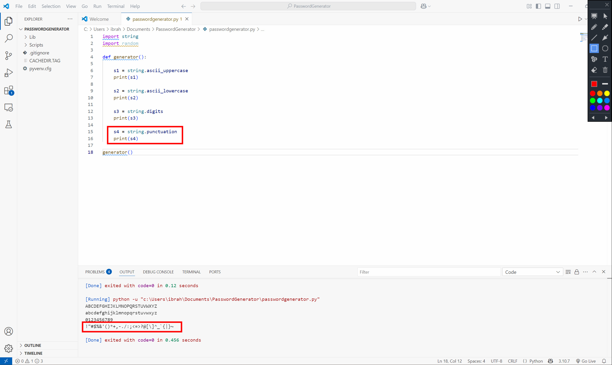
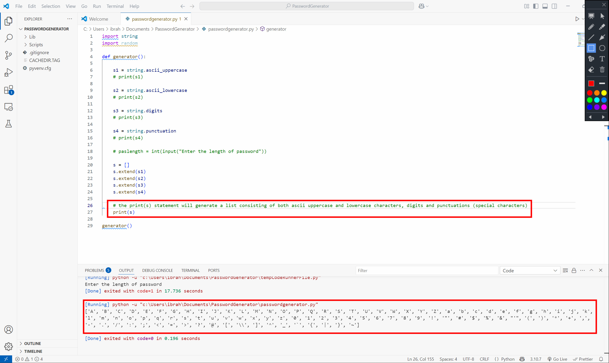
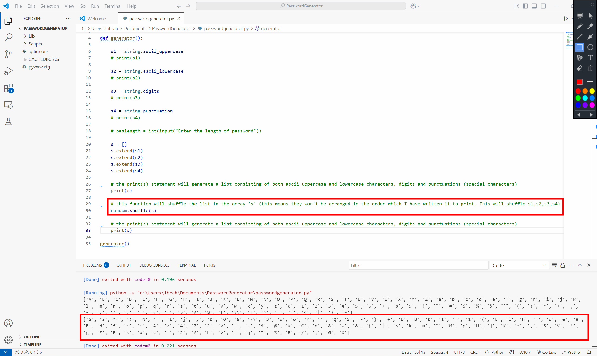
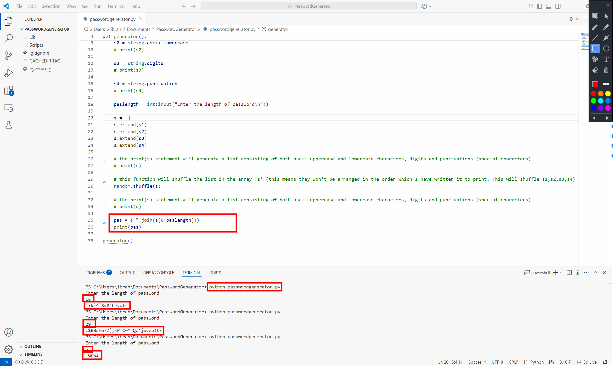

# Random Password Generator
This approach is similar to the implementation used in Google Password Manager, which suggests that users choose a strong password by mixing uppercase, lowercase, digits, and special characters. This project allows users to input the password length they wish to generate.

## How to create this project from scratch
1. Make sure you have Python installed on your machine. If you don't have it, download it from the official website https://www.python.org/
2. Download any text editor of your choice (Preferably visual Studio Code)
3. Create a new folder and open the folder in your text editor. Once you've done this, create a new Python file (passwordgenerator.py). Make sure you've set the virtual environment (you can look at my previous repository on how to do this)

Inside the passwordgenerator.py file, copy and paste this code.
```
import string
import random

def generator():

    s1 = string.ascii_uppercase
    print(s1)

    s2 = string.ascii_lowercase
    print(s2)

    s3 = string.digits
    print(s3)

    s4 = string.punctuation
    print(s4)

generator()
```

#### Output:
- s1 generates uppercase letters from A to Z
- s2 generates lowercase letters from a to z
- s3 generates digits from 0 - 9
- s4 generates punctuations (special characters) consisting of ~`!@#$%^&*()_-+={}[]:";',./<>?

#### Output:



Next, I wrote a code that merges all these strings (s1,s2,s3,s4) into a single string using a single print statement. The code below will create an array list of uppercase, lowercase, digits, and special characters.

```
import string
import random

def generator():

    s1 = string.ascii_uppercase
    # print(s1)

    s2 = string.ascii_lowercase
    # print(s2)

    s3 = string.digits
    # print(s3)

    s4 = string.punctuation
    # print(s4)

    # paslength = int(input("Enter the length of password\n"))

    s = []
    s.extend(s1)
    s.extend(s2)
    s.extend(s3)
    s.extend(s4)

    # the print(s) statement will generate a list consisting of both ascii uppercase and lowercase characters, digits and punctuations (special characters)
    print(s)

generator()
```

#### Output:


### Let's shuffle these strings (s1,s2,s3,s4) into a single array list (this will mix up uppercase, lowercase, digits, and special characters) using the code below.

```
import string
import random

def generator():

    s1 = string.ascii_uppercase
    # print(s1)

    s2 = string.ascii_lowercase
    # print(s2)

    s3 = string.digits
    # print(s3)

    s4 = string.punctuation
    # print(s4)

    # paslength = int(input("Enter the length of password\n"))

    s = []
    s.extend(s1)
    s.extend(s2)
    s.extend(s3)
    s.extend(s4)

    # the print(s) statement will generate a list consisting of both ascii uppercase and lowercase characters, digits and punctuations (special characters)
    print(s)

    # this function will shuffle the list in the array 's' (this means they won't be arranged in the order which I have written it to print. This will shuffle s1,s2,s3,s4)
    random.shuffle(s)

    # the print(s) statement will generate a list consisting of both ascii uppercase and lowercase characters, digits and punctuations (special characters)
    # print(s)

generator()
```

#### Output:


Now, let's write some code that allows the user to input the password length they wish to generate, shuffle them, and make them a combination of uppercase, lowercase, digits, and special characters.

```
import string
import random

def generator():

    s1 = string.ascii_uppercase
    # print(s1)

    s2 = string.ascii_lowercase
    # print(s2)

    s3 = string.digits
    # print(s3)

    s4 = string.punctuation
    # print(s4)

    paslength = int(input("Enter the length of password\n"))

    s = []
    s.extend(s1)
    s.extend(s2)
    s.extend(s3)
    s.extend(s4)

    # the print(s) statement will generate a list consisting of both ascii uppercase and lowercase characters, digits and punctuations (special characters)
    # print(s)

    # this function will shuffle the list in the array 's' (this means they won't be arranged in the order which I have written it to print. This will shuffle s1,s2,s3,s4)
    random.shuffle(s)

    # the print(s) statement will generate a list consisting of both ascii uppercase and lowercase characters, digits and punctuations (special characters)
    # print(s)

    pas = ("".join(s[0:paslength]))
    print(pas)

generator()
```

#### Output:


That's it for this project. I have successfully implemented the password generator Python project.

▶️ [Watch Demo Video](https://drive.google.com/file/d/1ysQisT_vEJuBcgbhcLUQ_DJ-4r-2ZNaQ/view?usp=sharing)

🌟 Contributing: Feel free to fork, improve, and submit pull requests! This is a great project to start learning Python scripting and GUI automation.

📬 Contact: For questions, suggestions, or collaborations, connect with me on LinkedIn (https://www.linkedin.com/in/isiaq-ibrahim-468588156/).

⭐ Don't forget to give it a star if you find this project interesting!
